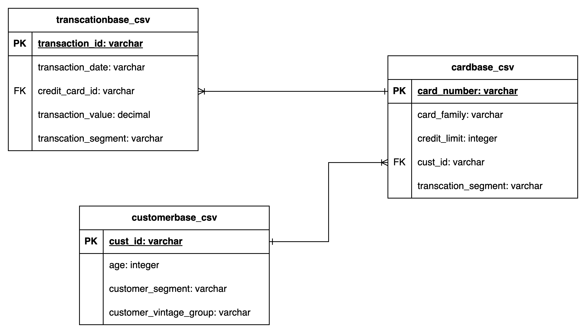
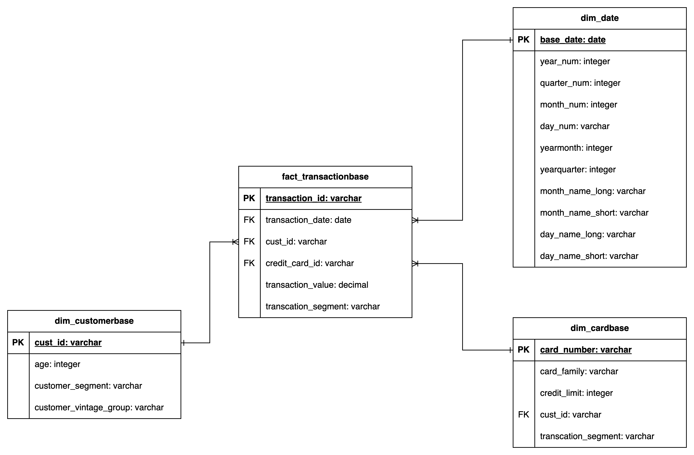

- [Requirements](#requirements)
- [Instructions](#instructions)
- [Answer](#answer)
  - [Using current model](#using-current-model)
- [Recommendations](#recommendations)
  - [Data model](#data-model)
    - [Transform the date column into a date field](#transform-the-date-column-into-a-date-field)
    - [Create a date dimension](#create-a-date-dimension)
  - [Apply clustering on tables](#apply-clustering-on-tables)
    - [FACT\_TRANSACTIONBASE](#fact_transactionbase)
  - [DIM\_CUSTOMERBASE](#dim_customerbase)
  - [DIM\_CARDBASE](#dim_cardbase)
  - [DIM\_DATE](#dim_date)
- [Answer using recommended model](#answer-using-recommended-model)
- [Query Performance Tuning](#query-performance-tuning)
  - [Appending incremental data](#appending-incremental-data)
  - [Reclustering](#reclustering)
  - [Analyzing Query Profile](#analyzing-query-profile)
  - [Analyzing Clustered table](#analyzing-clustered-table)

# Requirements

1. Write a query to determine total credit card transaction value by Customer_Segment for customers between the age group 30 - 40.
2. Write a query to determine top 5 customers who have made the most credit card transaction spend.
3. Write a query to determine list of customers who have spent more than their credit limit before June 2016.
4. Write a query to determine minimum, maximum and average credit card transaction value by Card_Family
5. Write a query to determine total credit card transaction value by month, percentage growth from previous month and Year to date transaction value.

    - Note:
        Year to date (YTD) transaction value = Transaction value between the beginning of the year and the current month.

# Instructions

1. Work on the above requirements using SQL and document the queries.
2. Feel free to add any recommendation on how you can improve query performance keeping in mind the above requirements or  a data model to
answer them efficiently.
3. Once completed, email the documentation file back to us.
4. Come prepared to talk about your code and possible extensions or modifications.

# Answer

- __All answers considers snowflake as the datawarehouse__
- __We will assume that our given tables holds huge amount of data__

## Using current model

- Since snowflake stores data in columnar format storage, it is recommended to only use columns which we need for our data.
- It will make our query more efficient because snowflake will only acess the columns we specify from the query.



1. Write a query to determine total credit card transaction value by Customer_Segment for customers between the age group 30 - 40.

    ```sql
    SELECT
        cust.customer_segment as CUSTOMER_SEGMENT,
        SUM(trans.transcation_value) as TOTAL_CARD_TRANSACTION
    FROM customerbase_csv cust
    INNER JOIN cardbase_csv card
        ON cust.cust_id = card.cust_id
    INNER JOIN transcationbase_csv trans
        ON card.card_number = trans.card_number
    WHERE cust.AGE BETWEEN 30 AND 40
    GROUP BY ALL;
    ```

2. Write a query to determine top 5 customers who have made the most credit card transaction spend.

   ```sql
    SELECT TOP 5
        cust.cust_id AS CUSTOMER_ID,
        SUM(trans.transcation_value) as TOTAL_CARD_TRANSACTION
    FROM customerbase_csv cust
    INNER JOIN cardbase_csv card
        ON cust.cust_id = card.cust_id
    INNER JOIN transcationbase_csv trans
        ON card.card_number = trans.card_number
    GROUP BY ALL
    ORDER BY TOTAL_CARD_TRANSACTION DESC;
   ```

3. Write a query to determine list of customers who have spent more than their credit limit before June 2016.

    ```sql
    WITH TOTAL_TRANSACTION AS (
        SELECT
            trans.cust_id AS CUST_ID,
            SUM(trans.transaction_value) AS TOTAL_CARD_TRANSACTION
        FROM transactionbase_csv trans
        WHERE TO_DATE(trans.transaction_date, 'DD-MON-YY') < DATE('2016-06-01')
        GROUP BY 1
    ), TOTAL_CARD_LIMIT AS (
        -- Given that the customer could have multiple cards with different card limits
        SELECT
            card.CUST_ID AS CUST_ID,
            SUM(card.CREDIT_LIMIT) AS TOTAL_CARD_LIMIT
        FROM cardbase_csv card
        GROUP BY 1
    )
    SELECT
        TRANS.CUST_ID AS CUST_ID,
        CARD.TOTAL_CARD_LIMIT - CUST.TOTAL_CARD_TRANSACTION AS REMAINING_LIMIT
    FROM TOTAL_TRANSACTION TRANS
    INNER JOIN TOTAL_CARD_LIMIT CARD
        ON TRANS.CUST_ID = CARD.CUST_ID
    WHERE REMAINING_LIMIT < 0;
    ```

4. Write a query to determine minimum, maximum and average credit card transaction value by Card_Family

    ```sql
    SELECT
        card.card_family AS CARD_FAMILY,
        MIN(trans.transaction_value) AS MINIMUM_SPEND,
        MAX(trans.transaction_value) AS MAXIMUM_SPEND,
        AVG(trans.transaction_value) AS AVERAGE_SPEND
    FROM cardbase_csv card
    INNER JOIN transactionbase_csv trans
        ON cust.card_number = card.credit_card_id
    GROUP BY ALL;
    ```

5. Write a query to determine total credit card transaction value by month, percentage growth from previous month and Year to date transaction value.

    - Note:
        Year to date (YTD) transaction value = Transaction value between the beginning of the year and the current month.

    ```sql
    WITH MONTHLY_TRANS AS (
        SELECT
            YEAR(TO_DATE(trans.transaction_date, 'DD-MON-YY')) AS TRANS_YEAR,
            TO_VARCHAR(TO_DATE(trans.transaction_date, 'DD-MON-YY'), 'YYYYMM') AS YEARMONTH,
            SUM(trans.transaction_value) AS MONTHLY_TRANSACTIONS,
            LAG(MONTHLY_TRANSACTIONS) OVER(ORDER BY YEARMONTH) AS PREVIOUS_MONTH_TRANS 
        FROM transactionbase_csv trans
    )
    SELECT
        YEARMONTH AS YEARMONTH,
        (MONTHLY_TRANSACTIONS - PREVIOUS_MONTH_TRANS) / PREVIOUS_MONTH_TRANS * 100 AS MONTH_GROWTH_RATE,
        SUM(MONTHLY_TRANSACTIONS) OVER(PARTITION BY TRANS_YEAR ORDER BY YEARMONTH) AS YTD_TRANSACTION
    FROM MONTHLY_TRANS
    ORDER BY YEARMONTH DESC

    ```

# Recommendations

- __All answers considers snowflake as the datawarehouse__
- __We will assume that our given tables holds huge amount of data__

## Data model

- It is recommend to model your data properly with correct data types as shown below.
- Our selected model is star schema
- This will help us have an easier visual of our model
- It is easier to build a query as it only requires us to do 1 level of join



### Transform the date column into a date field

- Since the column is already transformed, our final query to build the report won't need to account for the transformation which will result for a more effecient query execution.
- Additional note, snowflake stores DATE and TIMESTAMP columns more efficiently than VARCHAR also resulting to a better query performance.

### Create a date dimension

- Date dimension gives us another layer of attributes for the dates which will help us do less transformation for the transaction_date column.

## Apply clustering on tables

- If we don't apply clustering on our table, snowflake's query processing layer will analyze our data and apply automatic clustering to our data usually by the order of how we append to the table.
- To improve our query performance, we will apply clustering on our table in which we often use on filtering or in join conditions given by the requirements
- Snowflake recommends to have atmost 3-4 cluster keys on our table. Assigning more cluster keys tends to increase costs more than benefit.

### FACT_TRANSACTIONBASE

```sql
CREATE TABLE FACT_TRANSACTIONBASE (
    TRANSACTION_ID VARCHAR(50) PRIMARY KEY,
    TRANSACTION_DATE DATE,
    CUST_ID VARCHAR(50),
    CREDIT_CARD_ID: VARCHAR(50),
    TRANSACTION_VALUE NUMBER,
    TRANSACTION_SEGMENT VARCHAR(20)
)
CLUSTER BY (TRANSACTION_DATE, CUST_ID, CREDIT_CARD_ID, TRANSACTION_SEGMENT);
```

- We chose the following cluster keys on our table:
  - __TRANSACTION_DATE__
    - Transaction date will be the most actively uised in selective filters on our fact table as we would often want to filter our transactions for a specific period of time.
    - This is our first obvious choice as our cluster key and snowflake will partition our data based on range of transaction dates from 50mb ~ 500mb.
  - __CUST_ID/CREDIT_CARD_ID__
    - FACT_TRANSACTION base is a very small table based on attributes so we still have room for this column to be added as clustered key.
    - We add these column as an additional cluster key since we will frequently use this column on our join predicates.
  - __TRANSACTION_SEGMENT__
    - This column is also a good candidate for filtering, hence adding it to the cluster key will improve our query pruning as it will minimize the micro-partitions which our query will have to look at to output our desired data.

## DIM_CUSTOMERBASE

```sql
CREATE TABLE DIM_CUSTOMERBASE (
    CUST_ID VARCHAR(50) PRIMARY KEY,
    AGE INTEGER,
    CUSTOMER_SEGMENT VARCHAR(20),
    CUSTOMER_VINTAGE_GROUP VARCHAR(30)
)
CLUSTER BY (AGE, CUSTOMER_SEGMENT)
```

- __AGE__
  - This column is a very good candidate for our cluster key since we often want to filter our customer based on age group.
- __CUSTOMER_SEGMENT__
  - Since we don't have much columns to choose for clustering on this table. We will add this to our cluster key as we tend to group our customers by segment.

## DIM_CARDBASE

```sql
CREATE DIM_CARDBASE (
    CARD_NUMBER VARCHAR(50),
    CARD_FAMILY VARCHAR(20),
    CREDIT_LIMIT NUMBER,
    CUST_ID VARCHAR(50)
)
```

- For the case of DIM_CARDBASE dimension, we don't have much of a candidate for clustering.
- CARD_FAMILY could be a potential candidate but given the sample data, it seems that this column has a very low cardinality which will not probably give us a benefit even if we cluster by this column.

## DIM_DATE

- This dimension will help us minimize the transformation we need for the date attributes of the fact table which will result in a more effecient query.
- If we will be building a report through any semantic layer, we could also use access the attributes from this columns as we need them.

# Answer using recommended model

1. Write a query to determine total credit card transaction value by Customer_Segment for customers between the age group 30 - 40.

    ```sql
    SELECT
        CUST.CUSTOMER_SEGMENT AS CUSTOMER_SEGMENT,
        SUM(TRANS.TRANSACTION_VALUE) AS TOTAL_CARD_TRANSACTION
    FROM FACT_TRANSACTIONBASE TRANS
    INNER JOIN DIM_CUSTOMERBASE CUST
        ON TRANS.CUST_ID = CUST.CUST_ID
    WHERE CUST.AGE BETWEEN 30 AND 40;
    ```

2. Write a query to determine top 5 customers who have made the most credit card transaction spend.

    ```sql
    SELECT TOP 10
        TRANS.CUST_ID AS CUST_ID,
        SUM(TRANS.TRANSACTION_VALUE) AS TOTAL_CARD_TRANSACTION
    FROM FACT_TRANSACTIONBASE TRANS
    GROUP BY 1, ORDER BY 2 DESC;
    ```

3. Write a query to determine list of customers who have spent more than their credit limit before June 2016.

    ```sql
    WITH TOTAL_TRANSACTION AS (
        SELECT
            TRANS.CUST_ID AS CUST_ID,
            SUM(TRANS.TRANSACTION_VALUE) AS TOTAL_CARD_TRANSACTION
        FROM FACT_TRANSACTIONBASE TRANS
        WHERE TRANS.TRANSACTION_DATE < DATE('2016-06-01')
        GROUP BY 1
    ), TOTAL_CARD_LIMIT AS (
        SELECT
            CARD.CUST_ID AS CUST_ID,
            SUM(CARD.CREDIT_LIMIT) AS TOTAL_CARD_LIMIT
        FROM DIM_CARDBASE CARD
        GROUP BY 1
    )
    SELECT
        CUST_ID AS CUST_ID,
        CARD.TOTAL_CARD_LIMIT - TRANS.TOTAL_CARD_TRANSACTION AS REMAINING_LIMIT
    FROM TOTAL_TRANSACTION TRANS
    INNER JOIN TOTAL_CARD_LIMIT CARD
        ON TRANS.CUST_ID = CARD.CUST_ID
    WHERE REMAINING_LIMIT < 0;
    ```

4. Write a query to determine minimum, maximum and average credit card transaction value by Card_Family

    ```sql
    SELECT
        CARD.CARD_FAMILY AS CARD_FAMILY,
        MIN(TRANS.TRANSACTION_VALUE) AS MIN_TRANSACTION,
        MAX(TRANS.TRANSACTION_VALUE) AS MAX_TRANSACTION,
        AVG(TRANS.TRANSACTION_VALUE) AS AVG_TRANSACTION
    FROM FACT_TRANSACTIONBASE TRANS
    INNER JOIN DIM_CARDBASE CARD
        ON TRANS.CREDIT_CARD_ID = CARD.CARD_NUMBER
    GROUP BY 1;
    ```

5. Write a query to determine total credit card transaction value by month, percentage growth from previous month and Year to date transaction value.

    - Note:
        Year to date (YTD) transaction value = Transaction value between the beginning of the year and the current month.

    ```sql
    WITH MONTHLY_TRANS AS (
        SELECT
            DT.YEAR_NUM AS TRANS_YEAR,
            DT.YEARMONTH AS YEARMONTH,
            SUM(TRANS.TRANSACTION_VALUE) AS MONTHLY_TRANSACTIONS,
            LAG(MONTHLY_TRANSACTIONS) OVER(ORDER BY YEARMONTH) AS PREVIOUS_MONTH_TRANS
        FROM FACT_TRANSACTIONBASE TRANS
        INNER JOIN DIM_DATE DT
            ON TRANS.TRANSACTION_DATE = DT.TRANSACTION_DATE
    )
    SELECT
        YEARMONTH AS YEARMONTH,
        (MONTHLY_TRANSACTIONS - PREVIOUS_MONTH_TRANS) / PREVIOUS_MONTH_TRANS * 100 AS MONTHLY_GROWTH_RATE,
        SUM(MONTHLY_TRANSACTIONS) OVER(PARTITION BY TRANS_YEAR ORDER BY YEARMONTH) AS YTD_TRANSACTION
    FROM MONTHLY_TRANS
    ORDER BY YEARMONTH DESC;
    ```

# Query Performance Tuning

There will be cases where we will encounter a slow running queries as we build our reports from our model. That's why this step is very important for us to reach our optimal query perfomance.

## Appending incremental data

- Since we are applying clustering to our tables, it is important to note that snowflake recommends that there is a high queries to DML operations.
- We would like to append our data less frequently by inserting them by large batches.

## Reclustering

- As we perform DML operations on our clustered tables, the data in our table might become less clustered. Snowflake suggests that periodic/regular reclustring of the table is required to main optimal reclustering.
- We can also turn ON our automated reclustering so snowflake will handle it for us. Snowflake will only apply reclustering on our table if it will benefit our operation.
- Since reclustering of clustered table consumes snowflake credit, we can lessen this by making sure that we are ordering our dataset before appending to the clustered table to not mess up with the original clustering.

## Analyzing Query Profile

- Snowflake offers a query profile feature to enable users to analyze any query that has been ran against it's virtual warehouse.
- Upon analyzing our query profile, we would be able to get information if we can still improve our query performance.
- We can apply basic query performance tuning technique by modifying our SQL queries.
- Since query profile also shows how the data is read from our table's micro partition, if we noticed that there is a high ratio of partitions read vs total number of partition, we can review the clustering of our tables or apply reclustering.

## Analyzing Clustered table

- Snowflake offers a system function `SYSTEM$CLUSTERING_INFORMATION` to calculate clustering details such as clustering depth for a given table.
- We want to aim for a low number of clustering depth and partition overlaps to ensure higher query performance.
